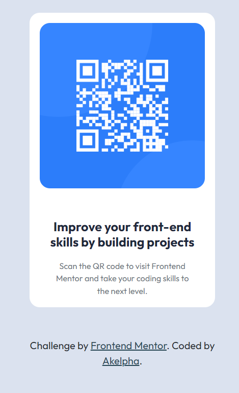

# Frontend Mentor - QR code component solution

This is a solution to the [QR code component challenge on Frontend Mentor](https://www.frontendmentor.io/challenges/qr-code-component-iux_sIO_H). Frontend Mentor challenges help you improve your coding skills by building realistic projects.

## Table of contents

- [Overview](#overview)
  - [Screenshot](#screenshot)
  - [Links](#links)
- [My process](#my-process)
  - [Built with](#built-with)
  - [What I learned](#what-i-learned)
  - [Continued development](#continued-development)
- [Author](#author)

## Overview

### Screenshot

Here a screenshot of my little projet!

### Links

- Solution URL: [GitHub](https://github.com/Akelpha/qrCode-component)
- Live Site URL: [QR code component-Netlify](https://qrcodecomponentessaie.netlify.app/)

## My process

### Built with

- Semantic HTML5 markup
- CSS custom properties
- Mobile-first workflow
- [Bootstrap](https://getbootstrap.com/) - For styles

### What I learned

I have learned how to use bootstrap with vite, in the beginning it was a little bit difficult for me to see images but after many researchs, i have found the problem.

### Continued development

I must improve my skill in boostrap and do more exercises on css especcially width, height(i alwayss forget how to use it very well).

## Author

- LinkedIn - [@keren-nzira](https://www.linkedin.com/in/keren-nzira/)
- Frontend Mentor - [@akelpha](https://www.frontendmentor.io/profile/Akelpha)
